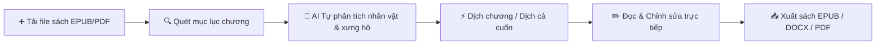

# 📚 AI Book Translator Pro (V2.5)

<p align="center">
  <strong>Phần mềm dịch sách tiếng Anh sang tiếng Việt chuyên sâu với chất lượng xuất bản cao cấp</strong><br>
  <em>Bảo toàn 100% cấu trúc sách, giữ ảnh minh họa, tự động định nghĩa nhân vật & xưng hô, văn phong thuần Việt trau chuốt.</em>
</p>

<p align="center">
  
  
  
  
  
</p>

---

## 🌟 Tính Năng Nổi Bật

### 1. ✍️ Văn phong thuần Việt & Giàu chất văn học ("Thật Hay")
- **Chấm dứt hoàn toàn tình trạng dịch máy thô cứng (word-by-word)**: Câu cú được AI biên tập uyển chuyển, giàu hình ảnh, nhịp điệu tự nhiên như sách xuất bản.
- **Hỗ trợ đa dạng nhà cung cấp AI hàng đầu**:
  - **Google Gemini**: Mặc định với `gemini-3.5-flash` và `gemini-3.1-pro-preview` (văn chương sâu sắc, am hiểu bối cảnh sách).
  - **Ollama (Chạy Offline 100% trên máy)**: Chạy trực tiếp trên GPU cá nhân (GTX/RTX 8GB VRAM) với mô hình `qwen2.5:7b` — dịch không cần internet, bảo mật 100% và vĩnh viễn không lo hết quota!
  - **DeepSeek (V3 / R1)**: Tốc độ cao, chi phí siêu rẻ, tiếng Việt xuất sắc.
  - **OpenAI & OpenRouter**: Hỗ trợ GPT-4o, Claude 3.5 Sonnet, v.v.

### 2. 👥 AI Tự Phân Tích Nhân Vật & Đại Từ Xưng Hô (Character Engine)
- **Nút "🤖 AI Tự phân tích nhân vật"**: Tự động tra cứu bách khoa toàn thư và cốt truyện tác phẩm để thiết lập danh sách nhân vật, vai trò và đại từ xưng hô phù hợp (*tôi - cậu, anh - em, chàng - nàng, sư phụ - đồ đệ*).
- **Ngăn ngừa đổi vai**: Giữ vững cách xưng hô của từng cặp nhân vật từ chương đầu đến chương cuối cuốn sách.

### 3. 🛡️ Cơ Chế Xử Lý Quota Thông Minh (Smart Quota Auto-Backoff & Pool)
- **Tự động chờ & Phục hồi khi gặp Rate Limit (HTTP 429)**: Tự động đếm ngược theo đúng số giây Google yêu cầu, sau đó tiếp tục dịch đoạn đang dở, **100% không làm mất hay sót đoạn**.
- **Tự động luân chuyển mô hình (Multi-Model Fallback)**: Tự động chuyển đổi giữa các mô hình (`gemini-3.5-flash` ➔ `gemini-flash-latest` ➔ `gemini-3.1-flash-lite`) khi một mô hình chạm ngưỡng dùng thử.
- **Gộp đoạn thông minh (Smart Chunking)**: Gói 1000 - 1200 từ (~12 đoạn văn/lần dịch) giúp giảm tới 65% số lần gọi API, tăng tốc độ và giữ ngữ cảnh tốt hơn.

### 4. 🔄 Linh Hoạt Dịch Lại ("Dịch lại từ đầu")
- Nút **`🔄 Dịch lại từ đầu`** giúp bạn dễ dàng xóa sạch bản dịch cũ của một chương bất kỳ và dịch lại bằng mô hình AI mới xịn hơn chỉ với 1 cú click.

### 5. 📖 Giao Diện Kép Hiện Đại (Studio & Reader)
- **Dual Studio (Song ngữ song song)**: Đối chiếu từng đoạn tiếng Anh và tiếng Việt, cho phép nhấp chuột sửa trực tiếp bản dịch với tính năng tự động lưu.
- **Kindle Reader Mode**: Chế độ đọc sách sang trọng, hỗ trợ tùy biến phông chữ (Merriweather Serif / Outfit Sans-serif), cỡ chữ và chế độ hiển thị:
  - *Chỉ tiếng Việt (Kèm thông báo thông minh nếu chương chưa dịch)*
  - *Song ngữ đối chiếu từng đoạn*
  - *Chỉ tiếng Anh*

### 6. 📱 Bảo Toàn 100% Định Dạng & Xuất Bản Đa Dạng
- **Bộ đọc đa định dạng**: Hỗ trợ **EPUB**, **PDF**, **DOCX**, **TXT** (kể cả các file EPUB sinh ra từ Calibre với thẻ `<div class="calibre...">`).
- **Xuất bản chuyên nghiệp**:
  - 📕 **EPUB Tiếng Việt**: Giữ nguyên toàn bộ ảnh minh họa, trang bìa, mục lục, sẵn sàng gửi lên Kindle, Kobo, iPad.
  - 📗 **EPUB Song Ngữ**: Tuyệt vời cho việc học ngoại ngữ.
  - 📄 **Word (.DOCX)**: Đầy đủ mục lục, căn lề chuẩn in ấn.
  - 🌐 **HTML Reader / In PDF**: Trực quan, hỗ trợ bấm `Ctrl + P` lưu file PDF chuẩn sách in.

---

## 🚀 Hướng Dẫn Cài Đặt & Sử Dụng

### 1. Khởi động nhanh trên Windows
Chỉ cần nhấp đúp chuột vào file **`run.bat`** ở thư mục gốc:
```
d:\ai_book_translator\run.bat
```
Ứng dụng sẽ tự khởi động máy chủ và mở trình duyệt tại: **`http://localhost:8000`**.

### 2. Khởi động bằng dòng lệnh
```bash
# Cài đặt thư viện phụ thuộc
pip install -r requirements.txt

# Khởi chạy server
python main.py
```

---

## ⚙️ Cấu Hình Mô Hình Dịch (API Settings)

Bấm vào biểu tượng **⚙️ Cài đặt API** ở góc trên bên phải màn hình để chọn chế độ:

| Chế độ | Mô hình | Ưu điểm | Chi phí / Giới hạn |
| :--- | :--- | :--- | :--- |
| **Google Gemini (Khuyên dùng)** | `gemini-3.5-flash` / `gemini-3.1-pro-preview` | Dịch văn học cực hay, máy mát rượi (0% GPU), siêu nhanh | **Miễn phí 100%** (Tự điều tiết quota) |
| **Ollama (Chạy Offline)** | `qwen2.5:7b` (Khuyên dùng cho GPU 8GB) | Chạy 100% trên GPU cá nhân, không cần mạng | **$0 trọn đời**, không bao giờ hết quota |
| **DeepSeek** | `deepseek-chat` (V3) | Văn phong tiếng Việt đỉnh cao, tốc độ vượt trội | Rất rẻ (~3.000 VNĐ / cả cuốn sách) |
| **Dịch tự động miễn phí** | `free-fallback` | Không cần bất kỳ API key nào, trải nghiệm tức thì | Miễn phí (văn phong máy thông thường) |

---

## 📖 Quy Trình Dịch Một Cuốn Sách



1. **Tải sách lên**: Bấm **"➕ Tải sách mới"** và chọn file sách tiếng Anh của bạn.
2. **Thiết lập nhân vật**: Mở bảng **"👥 Nhân vật & Văn phong"** ở góc phải, bấm **"🤖 AI Tự phân tích nhân vật"** để AI tự động điền danh xưng (*Kvothe xưng tôi, gọi Bast là cậu...*).
3. **Bắt đầu dịch**:
   - Bấm **"▶ Bắt đầu dịch"** để dịch toàn bộ sách.
   - Hoặc click chọn từng chương và bấm **"⚡ Dịch chương này"**.
4. **Đọc & Thưởng thức**: Chuyển sang tab **"📖 Chế độ đọc"** để đọc sách như trên máy đọc sách Kindle.
5. **Xuất file**: Bấm **"📥 Xuất bản sách"** để tải sách tiếng Việt về máy.

---

## 🛠️ Cấu Trúc Dự Án

```
ai_book_translator/
├── core/                   # Bộ máy xử lý cốt lõi
│   ├── parser.py           # Trích xuất EPUB (hỗ trợ Calibre), PDF, DOCX, TXT
│   ├── chunker.py          # Chia đoạn ngữ cảnh thông minh, gắn mã [[[P_id]]]
│   ├── translator.py       # Engine gọi AI (Gemini, Ollama, DeepSeek, Multi-Model)
│   ├── glossary.py         # Quản lý nhân vật, đại từ xưng hô & thuật ngữ
│   └── exporter.py         # Xuất bản EPUB tiếng Việt, EPUB song ngữ, DOCX, HTML
├── server/                 # Máy chủ backend FastAPI
│   ├── app.py              # REST API & điều khiển tiến trình
│   ├── database.py         # Quản lý dữ liệu dự án & tự động lưu từng đoạn
│   └── translator_worker.py# Luồng dịch ngầm chống nghẽn, tự động backoff quota
├── web/                    # Giao diện Single Page App (Dark Glassmorphism)
│   ├── index.html          # Cấu trúc giao diện Dual Studio & Reader Mode
│   ├── app.css             # Thiết kế hiện đại chuẩn giao diện cao cấp
│   └── app.js              # Xử lý logic giao diện, phím tắt & REST Polling 1.5s
├── main.py                 # File khởi động chính
├── run.bat                 # Trình khởi chạy 1-click cho Windows
└── requirements.txt        # Danh sách thư viện cần thiết
```

---

## 📜 Bản Quyền

Dự án được phát hành theo giấy phép **MIT License**. Tự do sử dụng, chỉnh sửa và phân phối cho mục đích cá nhân và phi thương mại.
